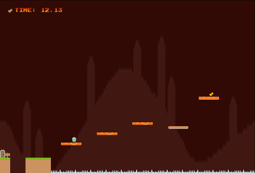

# Jump Around
## Jump Jump Jump Jump [...]

Jump Around is a 2D platformer that is simple to control yet
challenging to master. It was created as a small project to learn
about using the [Phaser game engine](http://phaser.io/). You can
[play the game here](http://dev.dale.io/jumparound/). A
[blog post](http://dale.io/2015/02/27/jump-around.html) was written
detailing some lessons learnt during the development of the game.

## How to run locally
1. Install dependencies with NPM: `cd <cloned repo root> && npm install`
2. Use `./builder.sh serve` to run a local development environment
   When ready for packaging, run `./builder.sh build`.
   
## Credits
All images (except 'loadingbar.png', 'author.png', and 'arrow.png')
and all audio (unless otherwise specified) created by
[Kenney](http://kenney.nl/).
'levelwin.ogg' created by
[Tuudurt](http://www.freesound.org/people/Tuudurt/sounds/258142/).

